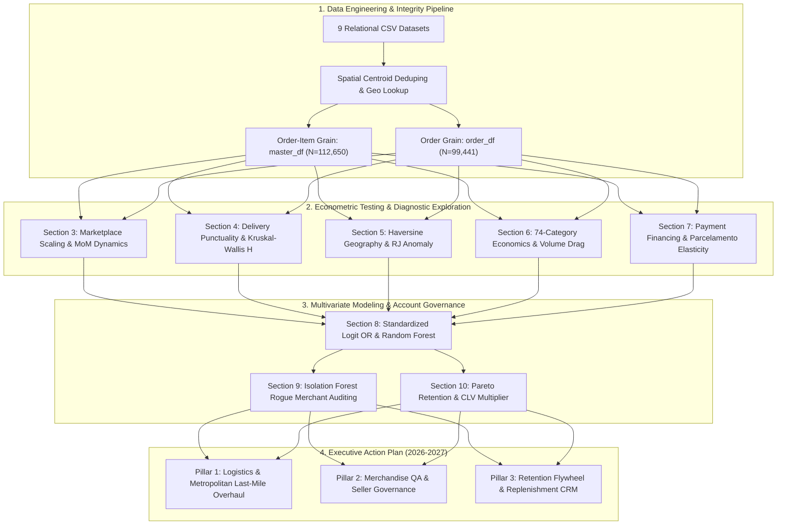

# Olist E-Commerce Strategic Diagnostic & Analytics Engine

> **Data Analytics Hackathon 2026 — Official Submission**  
> **Dataset Scope:** 99,441 Orders | 112,650 Items | 96,096 Customers | 3,095 Sellers | Sep 2016 – Oct 2018 | R$ 16.01M GMV  

[](https://colab.research.google.com/drive/1JKzUUMZXfyUj1rpmwJ8PpmjRcvNX3jFX?usp=sharing)
[](https://drive.google.com/drive/u/1/folders/1EFv49qNwlN1V1UMJDkuG_Q2ihD-ZIemT)
[](analysis_report.md)
[](olist_analytics.ipynb)

---

## 📌 Project Links & Submission Artifacts

- 📓 **Interactive Google Colab Notebook:** [Colab Link](https://colab.research.google.com/drive/1JKzUUMZXfyUj1rpmwJ8PpmjRcvNX3jFX?usp=sharing)
- 🎥 **Video Presentation & Walkthrough:** [Google Drive Folder](https://drive.google.com/drive/u/1/folders/1EFv49qNwlN1V1UMJDkuG_Q2ihD-ZIemT)
- 📑 **Comprehensive Submission Report:** [`analysis_report.md`](analysis_report.md)
- 📦 **Master Analytical Notebook:** [`olist_analytics.ipynb`](olist_analytics.ipynb)
- 🐙 **GitHub Repository:** [https://github.com/yuktac1011/Data_Analytics_Hackathon_2026](https://github.com/yuktac1011/Data_Analytics_Hackathon_2026)

---

## Executive Summary

This repository presents an institutional-grade, end-to-end strategic and operational diagnostic for **Olist**, Brazil's premier e-commerce marketplace integrator connecting thousands of small-to-medium merchants (SMEs) with major retail digital storefronts (Mercado Livre, B2W, Magazine Luiza).

While Olist scaled monthly order volume by **over $15\times$** between late 2016 and mid 2018 ($<500$ to $>7,200$ orders/month) without experiencing macro platform satisfaction collapse ($r = +0.245, p = 0.259$), **macroeconomic stability masked acute operational, geographic, and merchandise friction points**.

Through an empirical synthesis of **econometric modeling, non-parametric hypothesis testing ($\epsilon^2$), standardized multivariate logistic regression (Odds Ratios), depth-constrained Random Forest importance, and unsupervised Isolation Forest anomaly detection**, this study isolates the true structural determinants of customer dissatisfaction and formulates an actionable roadmap for executive leadership.



---

## 🔬 Key Empirical Findings & Metrics

### 1. Marketplace Scaling vs Quality ($r = +0.245, p = 0.259$)
- Scaling transaction throughput from $<500$ to $>7,200$ orders/month did **not** trigger structural quality degradation across 23 mature trading months.
- Temporary rating dips occurred strictly during extreme capacity surges (November 2017 Black Friday down to $3.894$★; March 2018 peak down to $3.734$★), reflecting localized carrier depot bottlenecks rather than platform failure.

### 2. Delivery Punctuality is the Decisive Satisfaction Driver ($H = 10,280.56, \epsilon^2 = 0.1065$)
Delivery delta ($\text{Actual Delivery Date} - \text{Estimated Delivery Date}$) directly accounts for **$10.7\%$ of all variance in customer ratings**:
- **Early ($<-3\text{d}$)**: **88.76%** of orders | **4.289★** average rating (rewarding customer expectations).
- **On-Time ($-3\text{ to }+2\text{d}$)**: **5.88%** of orders | **3.951★** average rating.
- **Late ($+3\text{ to }+7\text{d}$)**: **2.39%** of orders | **2.215★** average rating.
- **Very Late ($>+7\text{d}$)**: **2.97%** of orders | **1.691★** average rating (**72.6% 1-star review rate**).

```
Customer Review Score by Delivery Punctuality:
Early (<-3d)       [████████████████████████████████████████] 4.29★ (Median: 5.0)
On-Time (-3 to 2d) [█████████████████████████████████]       3.95★ (Median: 4.0)
Late (3 to 7d)     [██████████████████]                      2.22★ (Median: 1.0)
Very Late (>7d)    [██████████████]                          1.69★ (Median: 1.0)
```

### 3. Spatial Geography & The Rio de Janeiro Last-Mile Anomaly
- **Supply Hyper-Concentration**: **$59.74\%$ of all active sellers operate in São Paulo (SP)**, and the top 5 southeastern/southern states (SP, PR, MG, SC, RJ) command **$90.57\%$ of seller supply**.
- **Freight vs Delay**: Haversine distance scales freight cost directly (**$r = +0.315, p < 10^{-300}$**, adding $\approx R\$\ 10.00$ per 1,000 km), but shows **zero positive correlation with delivery delays ($r = -0.075$)**. Olist's routing engine buffers remote North/Northeast transit with 25–40 day delivery estimates.
- **The Rio de Janeiro Anomaly**: Rio de Janeiro (`RJ`) is Olist's **#2 market ($12,300$ orders; $12.8\%$ of GMV)** and is only **$489\text{ km}$** from the São Paulo seller core with modest freight (R$ 23.94). Yet RJ ranks **8th worst in average rating ($3.947$★)** nationally. Customer friction in major hubs is driven by **urban last-mile courier breakdowns, theft-security red zones, and sorting depot backlogs**, not distance.

### 4. Product Category Diagnostics & Volume Drag
- **Acute Emergency (`office_furniture`)**: Lowest review score on the platform (**$3.483$★** across 1,273 orders; $0.53$★ below mean; Logistic Regression $\text{OR} = 1.642\times$), driven by missing assembly hardware, complex flat-pack instructions, and transit cosmetic damage.
- **Top 3 Volume Drag Categories**: `bed_bath_table` ($3.874$★), `furniture_decor` ($3.890$★), and `computers_accessories` ($3.922$★) generate **$>R\$\ 2.67\text{M}$ GMV across $22,555$ orders**, but inflict an aggregate **$2,770$ rating star deficit** onto the platform.
- **Price-Satisfaction Independence**: Price vs review correlation is near zero ($r = +0.033$). Premium categories (e.g. `small_appliances_home_oven_and_coffee` at R$ 624, $4.10$★) thrive when packaging and listing specs are accurate.

### 5. Payment Financing & Installment Elasticity
- **Credit Card Dominance**: **$75.4\%$ of transactions** occur via Credit Card (R$ 12.54M), followed by Boleto Bancário (**$19.9\%$**, R$ 2.87M).
- **Financing Drives Purchasing Power**: Installment depth correlates strongly with ticket size (**$r = +0.318, \rho = +0.379$**). Median spend expands **$4.5\times$** from R$ 84.88 (1 installment) to R$ 384.70 (10 installments).
- **Payment Behavior is Orthogonal to NPS**: Payment instrument accounts for virtually zero variance in review scores ($\epsilon^2 = 0.000132$). Boleto exhibits 1–3 business day clearing latency, but yields identical customer satisfaction ($4.071$★ vs $4.073$★).

### 6. Multivariate Root Cause Analysis (Centerpiece)
Trained on 96,478 delivered orders to isolate factors driving 1–2 star low ratings ($\text{AUC-ROC} = 0.7459$):

```
Standardized Logit Odds Ratios (OR) for 1-2 Star Low Reviews:
[+] Delivery Delay (Days vs Est)   [2.178x] ═══════════════════════════════════ (RF Importance: 79.94%)
[+] Category: Office Furniture     [1.642x] ══════════════════════
[+] Customer State: Rio de Janeiro [1.463x] ════════════════
[+] Multi-Item Order Complexity    [1.343x] ════════════ (RF Importance: 9.19%)
[+] Category: Bed, Bath & Table    [1.314x] ═══════════
[+] Category: Computers & Acc      [1.283x] ══════════
[+] Category: Telephony            [1.225x] ════════
[+] Haversine Distance (km)        [1.138x] ═════
[-] Customer State: Sao Paulo      [0.868x] ════ (-13.2% Low Review Odds)
```

### 7. Unsupervised Isolation Forest Anomaly Detection
- Evaluated 1,271 active merchants on multi-attribute operational metrics (late rate, cancellation rate, review score, freight ratio).
- **Flagged 39 high-risk rogue merchants** (e.g., Seller `b1b3948701...` with **$50.0\%$ late delivery rate**, **$11.1\%$ cancellation rate**, and **$1.72$★ average rating**).
- Identified egregious local freight price gouging (e.g., Order `8272b63d...` charging **R$ 164.37 freight on a R$ 31.80 item across only 38.5 km in SP**, triggering an immediate 1-star review).

### 8. Repeat Customer Retention & CLV Pareto Economics
- **Acquisition-Driven Marketplace**: **$96.88\%$ of buyers transacted exactly once**.
- **$1.9\times$ Economic Leverage & CLV Lift**: Repeat buyers ($3.12\%$ of customer base) generate **$5.90\%$ of total revenue** and deliver a **$+94.7\%$ lift in Customer Lifetime Value** (**R$ 314.99 vs R$ 161.82**).
- **High NPS Resilience**: Repeat customers maintain higher satisfaction (**$4.092$★ vs $4.069$★**).

---

## 📊 Master Claims-to-Evidence Matrix

| # | Strategic Claim | Empirical Statistic & Test Result | Sample Scope | Notebook Section |
|---|---|---|---|---|
| **1** | Scaling did not degrade platform quality | Pearson $r = +0.245, p = 0.259$ (non-significant) | 23 full months | **Section 3.4** |
| **2** | Delivery timing is the primary satisfaction driver | Kruskal-Wallis $H = 10,280.56, p < 10^{-300}, \epsilon^2 = 0.1065$ | 96,478 orders | **Section 4.3** |
| **3** | Seller supply is heavily concentrated in SP/South | SP has $59.74\%$ of sellers; Top 5 states hold $90.57\%$ | 3,095 sellers | **Section 5.1** |
| **4** | Distance scales freight, not delivery delays | Freight vs Dist: $r = +0.315$; Delay vs Dist: $r = -0.075$ | 95,994 orders | **Section 5.3** |
| **5** | Rio de Janeiro is an urban last-mile failure anomaly | RJ is #2 market ($12.8\%$), $489\text{km}$ dist, but 8th worst rating ($3.95$★) | 12,300 orders | **Section 5.4** |
| **6** | `office_furniture` is the #1 category emergency | $3.483$★ rating across 1,273 orders ($0.53$★ below avg); $\text{OR} = 1.64\times$ | 1,273 orders | **Section 6.2** |
| **7** | Top 3 volume categories create 2,770-star deficit | `bed_bath_table` ($3.87$★), `furniture_decor` ($3.89$★), `computers` ($3.92$★) | 22,555 orders | **Section 6.2** |
| **8** | Payment behavior is orthogonal to NPS | Payment Type $\epsilon^2 = 0.000132$; Installments $r = -0.0408$ | 99,441 orders | **Section 7.3** |
| **9** | Installments scale order purchasing power | Pearson $r = +0.318$; Median AOV scales $4.5\times$ ($R\$\ 85 \to R\$\ 385$) | 74,975 CC orders | **Section 7.2** |
| **10** | Multivariate Root Causes: Delay & Multi-Item | Delay $\beta = +0.778 (\text{OR } 2.18\times)$; Item Count $\beta = +0.295 (\text{OR } 1.34\times)$ | 96,478 orders | **Section 8.2** |
| **11** | Unsupervised Isolation Forest flags rogue merchants | 39 anomalous sellers identified (e.g. Seller `b1b394...` with $50\%$ late rate) | 1,271 sellers | **Section 9.1** |
| **12** | Local freight gouging anomalies detected | Order `8272b6...`: $R\$\ 164.37$ freight for $R\$\ 31.80$ item over $38.5\text{km} \to 1$★ | 96,478 orders | **Section 9.3** |
| **13** | Repeat customers deliver double lifetime spend | Repeat rate $= 3.12\%$; CLV lift $= +94.7\%$ ($R\$\ 315.0$ vs $R\$\ 161.8$) | 96,096 customers | **Section 10.1** |

---

## 🎯 Strategic Recommendations Roadmap (2026 - 2027)

```
┌────────────────────────────────────────────────────────────────────────────────────────┐
│                        OLIST STRATEGIC ROADMAP (2026 - 2027)                          │
├─────────────────────────┬───────────────────────────┬──────────────────────────────────┤
│ PILLAR 1: LOGISTICS     │ PILLAR 2: MERCHANDISE     │ PILLAR 3: RETENTION & CRM        │
│ Urban Hubs & Dynamic ETA│ Packaging & QA Standards  │ Consumable Replenishment Flywheel│
├─────────────────────────┼───────────────────────────┼──────────────────────────────────┤
│ • Overhaul RJ SLAs      │ • Mandatory packaging cert│ • Post-delivery replenishment    │
│ • Micro-sorting hubs    │   for office_furniture    │   alerts (health/beauty, baby)   │
│ • Real-time traffic ETA │ • 5% defect return cap    │ • Cross-category loyalty vouchers│
│ • Automated freight caps│ • Catalog listing freeze  │ • Repeat rate: 3.1% -> 6.0%      │
│   for short-haul routes │   on stockout sellers     │   (+$800k high-margin GMV)       │
└─────────────────────────┴───────────────────────────┴──────────────────────────────────┘
```

1. **Pillar 1: Logistics & Metropolitan Last-Mile Overhaul**
   - **Remediate Rio de Janeiro**: Partner with dedicated urban last-mile carriers in RJ and establish regional cross-docking micro-hubs in the Baixada Fluminense and Northern Zone.
   - **Dynamic Local Freight Caps**: Deploy programmatic freight caps ($R\$\ /\text{km}$ per kg) on short-haul intra-state routes to prevent merchant freight margin gouging.
   - **Preserve Long-Haul Buffer Logic**: Maintain dynamic ETA buffer calculations for North/Northeast routes to prevent distance from driving delivery failure.

2. **Pillar 2: Merchandise Quality & Seller Governance**
   - **Mandatory Packaging Certification**: Institute strict drop-test packaging and hardware verification requirements for `office_furniture` and `furniture_decor`.
   - **Backend Isolation Forest Auditing**: Embed the unsupervised Isolation Forest model into the seller onboarding pipeline to auto-quarantine merchants with $>15\%$ late rates or $>10\%$ stockouts.
   - **Listing Attribute Standardization**: Auto-validate dimensions and compatibility tags in `bed_bath_table` and `computers_accessories` to reduce expectation mismatches.

3. **Pillar 3: Customer Retention & Repeat Flywheel**
   - **Automated Replenishment Cadences**: Capitalize on the **$1.95\times$ CLV multiplier** of repeat buyers by establishing automated CRM replenishment triggers for fast-moving categories (`health_beauty`, `baby`, `pet_shop`) at 30-, 60-, and 90-day intervals.
   - **Cross-Category Second-Order Incentives**: Offer targeted second-order discount vouchers to one-time buyers of high-ticket durable goods.
   - **Financial Impact**: Expanding repeat customer rate from **$3.12\%$ to $6.00\%$** unlocks **$>$ R$ 800,000 in incremental high-margin GMV** with zero incremental CAC.

---

## 📁 Repository Structure

```
Data_Analytics_Hackathon_2026/
├── Dataset/                              # 9 Olist Relational CSV Files
│   ├── olist_customers_dataset.csv
│   ├── olist_geolocation_dataset.csv
│   ├── olist_order_items_dataset.csv
│   ├── olist_order_payments_dataset.csv
│   ├── olist_order_reviews_dataset.csv
│   ├── olist_orders_dataset.csv
│   ├── olist_products_dataset.csv
│   ├── olist_sellers_dataset.csv
│   └── product_category_name_translation.csv
├── analysis_report.md                    # Official Comprehensive Submission Report
├── olist_analytics.ipynb                 # Master Reproducible Analytics & ML Notebook
└── README.md                             # Project Overview & Executive Summary
```

---

## 💻 Reproducibility & Installation

### Option 1: Run via Google Colab (Recommended)
Launch the fully executed and interactive notebook directly in Colab:  
👉 **[Open in Google Colab](https://colab.research.google.com/drive/1JKzUUMZXfyUj1rpmwJ8PpmjRcvNX3jFX?usp=sharing)**

### Option 2: Run Locally
```bash
# Clone the repository
git clone https://github.com/yuktac1011/Data_Analytics_Hackathon_2026.git
cd Data_Analytics_Hackathon_2026

# Create and activate a virtual environment
python -m venv venv
source venv/bin/activate  # On Windows: venv\Scripts\activate

# Install required dependencies
pip install pandas numpy matplotlib seaborn scipy scikit-learn jupyter

# Launch the notebook
jupyter notebook olist_analytics.ipynb
```

---

## 👥 Hackathon Submission Details

- **Hackathon:** Data Analytics Hackathon 2026
- **Repository:** [https://github.com/yuktac1011/Data_Analytics_Hackathon_2026](https://github.com/yuktac1011/Data_Analytics_Hackathon_2026)
- **Colab Link:** [https://colab.research.google.com/drive/1JKzUUMZXfyUj1rpmwJ8PpmjRcvNX3jFX?usp=sharing](https://colab.research.google.com/drive/1JKzUUMZXfyUj1rpmwJ8PpmjRcvNX3jFX?usp=sharing)
- **Video Walkthrough:** [https://drive.google.com/drive/u/1/folders/1EFv49qNwlN1V1UMJDkuG_Q2ihD-ZIemT](https://drive.google.com/drive/u/1/folders/1EFv49qNwlN1V1UMJDkuG_Q2ihD-ZIemT)

*All models, statistical tests, visualizations, and econometric calculations are fully reproducible within `olist_analytics.ipynb`.*
