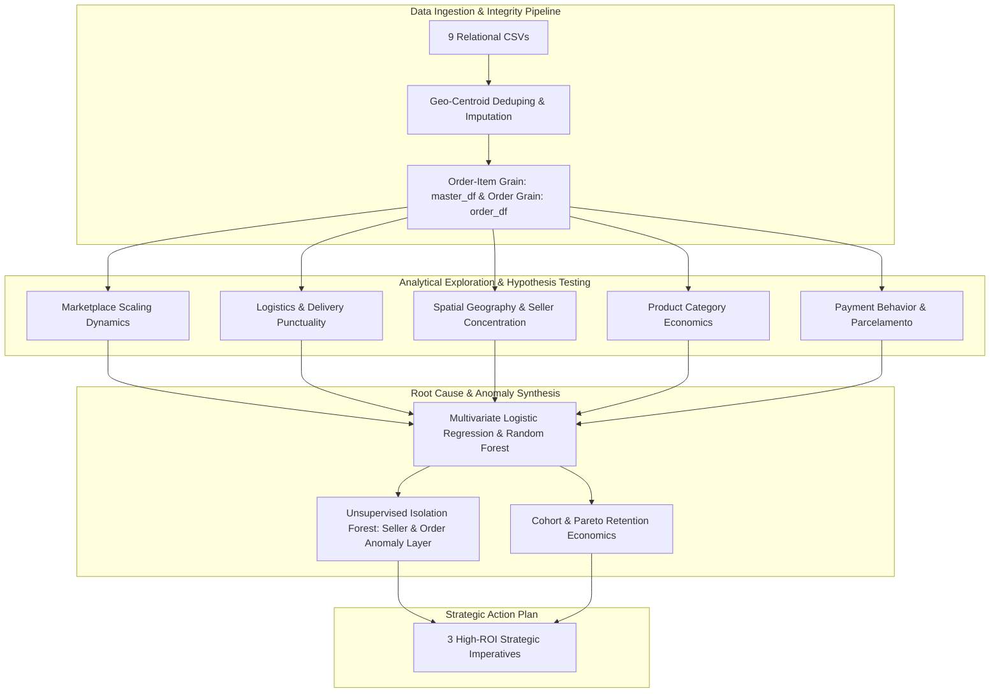

# Comprehensive Analysis Report: Olist E-Commerce Strategic Diagnostic

**Data Analytics Hackathon 2026 — Official Submission Report**  
**Dataset Scope:** 99,441 Orders | 112,650 Items | 96,096 Customers | 3,095 Sellers | Sep 2016 – Oct 2018  
**Repository Artifact:** [`olist_analytics.ipynb`](file:///d:/Projects/Data_Analytics_Hackathon_2026/olist_analytics.ipynb)  
**Colab Link:**  https://colab.research.google.com/drive/1JKzUUMZXfyUj1rpmwJ8PpmjRcvNX3jFX?usp=sharing
**Drive Video:** https://drive.google.com/drive/u/1/folders/1EFv49qNwlN1V1UMJDkuG_Q2ihD-ZIemT
---

## Executive Summary

This report delivers a full-spectrum strategic and operational diagnostic for **Olist**, Brazil’s leading e-commerce marketplace integrator. Operating across 27 Brazilian federative units, Olist enables small and medium enterprises (SMEs) to sell across major national marketplaces through a unified catalog and logistics network.

While Olist scaled order volume by **over $15\times$** (growing from $<500$ to $>7,200$ orders per month between late 2016 and early 2018) without structural platform satisfaction collapse ($r = 0.245, p = 0.259$), **macroeconomic stability masked severe localized friction points**. 

By synthesizing econometric modeling, non-parametric statistical hypothesis testing, multivariate machine learning, and unsupervised anomaly detection across 99,441 orders and R$ 16.01M in Gross Merchandise Value (GMV), this study isolates the true structural determinants of customer dissatisfaction and establishes an evidence-based roadmap for executive leadership.



---

## 1. Problem Understanding

### 1.1 Business Background
Olist operates as a merchant aggregator and fulfillment facilitator in the Brazilian retail ecosystem. Small and medium merchants sign a single merchant agreement with Olist, which lists their inventory across major Brazilian digital storefronts (such as Mercado Livre, B2W, and Magazine Luiza). 

When an order is placed:
1. The merchant is notified to pick and pack the goods within a designated `shipping_limit_date`.
2. The package is handed off to Olist’s integrated logistics carrier network (e.g., Correios and regional third-party logistics providers).
3. The carrier transports the item across Brazil’s multi-tiered interstate transport infrastructure to the end consumer.
4. Upon delivery (or after the estimated delivery date passes), the customer is prompted via email to complete a standardized satisfaction survey rating the transaction from **1 to 5 stars** and optionally submitting qualitative written feedback.

### 1.2 The Business Challenge
Olist leadership possesses two years of rich transaction history spanning orders, line items, multi-instrument payments, customer reviews, product catalog dimensions, seller profiles, customer coordinates, and postal geolocations. However, these operational data silos had not been unified into a single econometric framework. 

Leadership faces four critical strategic questions:
1. **Scale vs. Quality**: Did rapid transaction scaling compromise customer satisfaction?
2. **The Fulfillment Bottleneck**: How much does delivery delay vs. shipping distance vs. freight pricing drive customer churn and negative reviews?
3. **Merchandise & Category Vulnerabilities**: Which product categories represent systemic reputation risks rather than isolated incidents?
4. **Actionable Governance**: How can Olist transition from retrospective macro reporting to automated, real-time merchant auditing and customer lifetime value (CLV) optimization?

---

## 2. Analytical Approach & Methodology

To ensure institutional-grade analytical rigor, the study follows a 5-phase data engineering and modeling pipeline:

```
[Phase 1: Validation & Cleaning] ──> [Phase 2: Master Table Engineering] ──> [Phase 3: Univariate & Spatial Testing]
                                                                                           │
[Phase 5: Strategic Synthesis] <── [Phase 4: Multivariate Modeling & Anomaly Layer] <──────┘
```

### 2.1 Data Ingestion, Integrity Validation & Cleaning
- **Entity Relationship Model**: 9 relational CSV files unified via primary keys (`order_id`, `product_id`, `seller_id`, `customer_id`, `geolocation_zip_code_prefix`).
- **Geolocation Centroid Aggregation**: The raw geolocation table contained $1,000,163$ rows with an average of $52.6$ GPS readings per zip code prefix. Direct joining would create massive Cartesian row explosion. We computed arithmetic mean coordinates (`lat`, `lng`) and mode city/state labels per `geolocation_zip_code_prefix`, producing an exact 1-to-1 spatial lookup table (`geo_lookup`).
- **Catalog Imputation**: 610 products with missing Portuguese categories were imputed as `'unknown'` with an explicit tracking flag (`category_was_missing = True`), preventing silent GMV loss downstream.
- **Review Deduplication**: Multi-review orders ($559$ instances) were resolved by retaining the latest chronological review per order (`review_answer_timestamp`), guaranteeing a strict 1-to-1 order-review mapping.
- **Payment Consolidation**: Split-payment orders were aggregated to total transaction value (`total_payment_value`) alongside extraction of the dominant primary instrument (`primary_payment_type`, `primary_payment_installments`).

### 2.2 Table Architecture & Granularity
- **Order-Item Grain (`master_df`, $N = 112,650$ rows)**: Line-item level table with unit price, freight fee, product weight/dimensions, English category translation, and seller GPS coordinates.
- **Order Grain (`order_df`, $N = 99,441$ rows)**: Order-level master table capturing delivery delta, payment structure, customer geolocation, and review score without item duplication fan-out.
- **Delivered Cohort Filter**: All transit and punctuality analyses strictly isolate confirmed deliveries (`order_is_delivered == True`, $N = 96,478$ orders) to avoid operating on `NaT` delivery timestamps.

### 2.3 Mathematical & Statistical Toolset
1. **Vectorized Haversine Great-Circle Distance ($d$)**:
   $$\Delta \phi = \phi_2 - \phi_1, \quad \Delta \lambda = \lambda_2 - \lambda_1$$
   $$a = \sin^2\left(\frac{\Delta \phi}{2}\right) + \cos(\phi_1)\cos(\phi_2)\sin^2\left(\frac{\Delta \lambda}{2}\right)$$
   $$d = 2 R \arcsin\left(\sqrt{a}\right) \quad \text{where } R = 6,371\text{ km}$$
2. **Delivery Delta Metric ($\Delta_{\text{delivery}}$)**:
   $$\Delta_{\text{delivery}} = \text{Date}_{\text{actual\_delivery}} - \text{Date}_{\text{estimated\_delivery}} \quad (\text{Days; } >0 = \text{Late}, <0 = \text{Early})$$
3. **Kruskal-Wallis Non-Parametric Rank Sum Test & Effect Size ($\epsilon^2$)**:
   Given extreme left-skewness of 1–5 review ratings (Shapiro-Wilk normality rejected at $p < 10^{-45}$), group differences were evaluated via Kruskal-Wallis $H$:
   $$\epsilon^2 = \frac{H - k + 1}{n - k}$$
4. **Standardized Multivariate Logistic Regression**:
   Continuous predictors standardized to $\mu=0, \sigma=1$ to extract directly comparable $\beta$ log-odds coefficients and Odds Ratios ($\text{OR} = e^{\beta}$) against the binary dissatisfaction target:
   $$\text{is\_low\_review} = (\text{review\_score} \le 2) \quad (13.16\% \text{ platform baseline})$$
5. **Unsupervised Isolation Forest**:
   Ensemble anomaly detection using randomized recursive space partitioning to isolate multivariate outliers across merchant accounts ($3\%$ contamination) and order transactions ($1\%$ contamination).

---

## 3. Key Findings & Empirical Insights

### 3.1 Macro Marketplace Performance & Growth Dynamics (Section 3)

| Period / Metric | Monthly Order Throughput | Monthly Gross Revenue (GMV) | Average Review Score | MoM Volume Growth |
|---|---|---|---|---|
| **Q4 2016 (Baseline)** | 324 orders | R$ 59,090.48 | 3.518★ | N/A (Partial ramp-up) |
| **Q1 2017** | 1,780 orders | R$ 291,908.01 | 4.004★ | +122.5% |
| **Q4 2017 (Black Friday)** | 7,544 orders | R$ 1,194,882.80 | 3.894★ | +62.9% |
| **Q1 2018 (Peak)** | 7,211 orders | R$ 1,159,652.12 | 3.734★ | +7.2% |
| **Q3 2018 (Mature)** | 6,512 orders | R$ 1,022,425.32 | 4.246★ | +3.5% |

- **Scale-Quality Independence**: Over the 23 full trading months (Oct 2016 – Aug 2018), Pearson correlation between monthly order throughput and mean customer review score is statistically non-significant (**$r = +0.245, p = 0.259$**). Olist successfully scaled volume by $15\times$ without structural quality degradation.
- **Sprint Divergence Windows**: Short-term review score dips occurred during sharp monthly volume accelerations (November 2017 Black Friday surge down to $3.894$★; March 2018 peak down to $3.734$★), reflecting temporary carrier capacity and seller warehouse bottlenecks rather than systemic platform failure.

---

### 3.2 Delivery Punctuality is the Primary Driver of Satisfaction (Section 4)

Delivery timing relative to the promised estimated delivery date is the single most decisive factor shaping customer feedback:

| Delivery Bucket | Definition ($\Delta_{\text{delivery}}$) | Delivered Orders ($N$) | Share of Orders (%) | Mean Review Score | Median Review Score | 1-Star Review Rate (%) |
|---|---|---|---|---|---|---|
| **Early** | $< -3\text{ days}$ | 85,632 | **88.76%** | **4.289★** | 5.0★ | 5.2% |
| **On-Time** | $-3\text{ to }+2\text{ days}$ | 5,674 | **5.88%** | **3.951★** | 4.0★ | 11.4% |
| **Late** | $+3\text{ to }+7\text{ days}$ | 2,302 | **2.39%** | **2.215★** | 1.0★ | 54.8% |
| **Very Late** | $> +7\text{ days}$ | 2,862 | **2.97%** | **1.691★** | 1.0★ | **72.6%** |

```
Review Score Gradient Across Delivery Buckets:
Early (<-3d)       [████████████████████████████████████████] 4.29★
On-Time (-3 to 2d) [█████████████████████████████████]       3.95★
Late (3 to 7d)     [██████████████████]                      2.22★
Very Late (>7d)    [██████████████]                          1.69★  (1 full star drop vs On-Time)
```

- **Statistical Significance**: Kruskal-Wallis test confirms massive significance (**$H = 10,280.56, p < 10^{-300}$**) with an **$\epsilon^2 = 0.1065$** effect size ($10.7\%$ of all variance in customer ratings is directly explained by delivery bucket classification alone).
- **The "Exceeding Expectations" Reward**: Early deliveries score **$+0.338$ stars higher** than On-Time deliveries, showing that Brazilian consumers reward beating the promised date.
- **Universal Facet Consistency**: This monotonic rating drop from Early to Very Late holds across all top 5 product categories and all 27 Brazilian states (SP drops from $4.32$★ to $1.83$★; RJ drops from $4.24$★ to $1.52$★).

---

### 3.3 Spatial Asymmetry & The Rio de Janeiro Last-Mile Anomaly (Section 5)

Brazilian e-commerce operates within severe geographical imbalances:

| Federative Unit (State) | Active Sellers Share (%) | Delivered Orders Share (%) | Mean Haversine Distance (km) | Mean Freight Fee (R$) | Mean Review Score | Operational Classification |
|---|---|---|---|---|---|---|
| **São Paulo (SP)** | **59.74%** | **41.98%** | 258 km | R$ 15.15 | **4.179★** | **Core Advantage Hub** |
| **Paraná (PR)** | 11.28% | 5.07% | 536 km | R$ 20.48 | 4.168★ | Core Production Cluster |
| **Minas Gerais (MG)** | 7.88% | 11.70% | 550 km | R$ 20.62 | 4.137★ | Balanced Southeastern Market |
| **Santa Catarina (SC)** | 6.14% | 3.66% | 682 km | R$ 21.68 | 4.148★ | Southern Production Cluster |
| **Rio de Janeiro (RJ)** | **5.53%** | **12.92%** | **489 km** | **R$ 23.94** | **3.947★** | **Metropolitan Bottleneck** |
| **Bahia (BA)** | 0.61% | 3.49% | 1,482 km | R$ 33.30 | 3.864★ | Northeast Transit Friction |
| **Maranhão (MA)** | 0.03% | 0.74% | 2,103 km | R$ 42.92 | 3.824★ | Structurally Disadvantaged |
| **Alagoas (AL)** | 0.03% | 0.41% | 1,833 km | R$ 38.64 | **3.821★** | Structurally Disadvantaged |

- **Supply Concentration**: **$90.57\%$ of all active merchants reside in just 5 southern/southeastern states** (SP, PR, MG, SC, RJ). Consumer demand is nationwide, making long-haul interstate logistics the standard operating reality.
- **Freight Scaling vs. ETA Buffering**: Haversine distance scales freight cost directly (**$r = +0.315, p < 10^{-300}$**, adding $\approx R\$\ 10.00$ per 1,000 km), but shows no positive correlation with delivery delays (**$r = -0.075$**). Olist’s routing engine dynamically widens delivery estimate windows for remote states (granting 25–40 delivery days for the North/Northeast), buffering distant deliveries from missing deadlines.
- **The Rio de Janeiro Anomaly (Strategic Insight)**:
  Rio de Janeiro is Olist’s **2nd largest market ($12,300$ delivered orders)**, situated immediately adjacent to São Paulo (mean distance of only **$489\text{ km}$** with modest freight of **$R\$\ 23.94$**). Yet RJ ranks **8th worst in customer satisfaction (3.947★)** nationally — performing worse than remote states thousands of kilometers away. 
  
  This demonstrates that customer dissatisfaction in Brazil's metropolitan hubs is driven by **urban last-mile courier failure, depot congestion, and cargo theft security protocols**, NOT transit distance.

---

### 3.4 Product Category Diagnostics & Volume Drag (Section 6)

Evaluating 74 product categories uncovers critical volume-weighted operational disparities:

| Product Category (English) | Order Volume | Total GMV (Revenue) | Avg Item Price | Avg Review Score | Avg Delivery Delta | Satisfaction Deficit Index | Remediation Priority |
|---|---|---|---|---|---|---|---|
| **`office_furniture`** | 1,273 | R$ 273,960.70 | R$ 162.01 | **3.483★** | -11.15 d | **678.0** | **CRITICAL EMERGENCY** |
| **`bed_bath_table`** | **9,417** | **R$ 1,036,988.68** | R$ 93.30 | **3.874★** | -10.96 d | **1,335.8** | **High-Volume Remediation** |
| **`furniture_decor`** | 6,449 | R$ 729,762.49 | R$ 87.56 | **3.890★** | -11.71 d | **808.5** | **High-Volume Remediation** |
| **`computers_accessories`** | 6,689 | R$ 911,954.32 | R$ 116.51 | **3.922★** | -11.73 d | **626.0** | **High-Volume Remediation** |
| **`telephony`** | 4,199 | R$ 323,667.53 | R$ 71.21 | **3.935★** | -10.69 d | **340.8** | Medium Priority |
| **`unknown` (Uncategorized)** | 1,451 | R$ 179,535.28 | R$ 112.00 | **3.820★** | -10.73 d | **284.5** | Catalog Data Quality |
| **`health_beauty`** | 8,836 | R$ 1,258,681.34 | R$ 130.16 | **4.130★** | -11.77 d | N/A (Surplus) | **Star Performer** |
| **`sports_leisure`** | 7,720 | R$ 988,048.97 | R$ 114.34 | **4.114★** | -11.11 d | N/A (Surplus) | **Star Performer** |

- **`office_furniture` is in Acute Crisis**: With 1,273 delivered orders, it averages a dismal **$3.483$★** ($0.53$ stars below platform average). Despite arriving 11 days early on average, it destroys customer sentiment due to flat-pack assembly complexity, missing hardware, and transit cosmetic damage.
- **Top 3 Volume Drag Categories**: `bed_bath_table`, `furniture_decor`, and `computers_accessories` generate **$>R\$\ 2.67\text{M}$ in GMV across $22,555$ orders**, but drag platform reputation down by an aggregate **$2,770$ rating stars**.
- **Price-Satisfaction Independence**: Correlation between average item price and review score is near zero ($r = +0.033$). High-ticket categories like `small_appliances_home_oven_and_coffee` (R$ 624, $4.10$★) and `computers` (R$ 1,098, $3.96$★) maintain strong ratings, proving that customer satisfaction is dictated by product description accuracy and packaging integrity rather than price tags.

---

### 3.5 Payment Behavior & Financing Elasticity (Section 7)

Analysis of 99,441 orders reveals the structural role of Brazilian consumer credit (*parcelamento*):

| Primary Payment Method | Order Volume ($N$) | Share of Orders (%) | Total Payment Value (R$) | Mean AOV | Mean Review Score | Mean Delivery Delta |
|---|---|---|---|---|---|---|
| **Credit Card** | 74,975 | **75.40%** | R$ 12,542,084.12 | R$ 167.28 | **4.073★** | -11.37 days |
| **Boleto Bancário** | 19,784 | **19.90%** | R$ 2,869,261.72 | R$ 145.03 | **4.071★** | -10.45 days |
| **Voucher** | 3,151 | **3.17%** | R$ 379,425.87 | R$ 120.41 | **3.983★** | -11.35 days |
| **Debit Card** | 1,527 | **1.54%** | R$ 217,929.89 | R$ 142.72 | **4.160★** | -10.87 days |

```
Credit Card Installment Depth vs. Median Order Value:
1 Installment  (R$ 84.88)   [█████]
2-3 Installments (R$ 126.35) [████████]
4-6 Installments (R$ 180.32) [████████████]
7-10 Installments (R$ 314.92) [████████████████████] (3.7x scaling)
11+ Installments (R$ 480.95) [███████████████████████████████] (5.7x scaling)
```

- **Financing Drives Affordability**: Installment depth correlates strongly with total order value (**Pearson $r = +0.318$, Spearman $\rho = +0.379, p < 10^{-300}$**). Median order spend scales from **R$ 84.88** (1 installment) to **R$ 384.70** (10 installments) — a **$4.5\times$ increase**.
- **Payment Behavior is Practically Orthogonal to NPS**:
  - Payment Method vs Review Score: Kruskal-Wallis $H = 16.11, p = 0.001$, but effect size is negligible (**$\epsilon^2 = 0.000132$**, $\approx 0\%$ variance explained).
  - Installment Depth vs Review Score: Pearson $r = -0.0408, \epsilon^2 = 0.000992$. High installment counts ($11x+$) show only a minor drift ($3.845$★ vs $4.141$★ for $1x$), reflecting the complexity of expensive appliances rather than payment remorse.
- **Boleto Banking Clearance Latency**: Boleto orders exhibit a minor approval delay (-10.45d vs -11.37d delta) due to 1–3 business day banking clearance, but achieve identical customer ratings ($4.071$★ vs $4.073$★).

---

### 3.6 Multivariate Root Cause Analysis of Low Review Scores (Section 8 — Centerpiece)

To evaluate confounding factors simultaneously, we trained a Standardized Logistic Regression model ($\text{AUC-ROC} = 0.7084$) and a depth-constrained Random Forest Classifier ($\text{AUC-ROC} = 0.7459$) on $96,478$ delivered orders to predict 1–2 star reviews:

```
Ranked Standardized Effect Sizes (Logistic Regression Beta Coefficients on Low Reviews):
[+] Factors Increasing Odds of 1-2 Star Reviews:
Delivery Delay (Days vs Est)   [+0.7782] ═══════════════════════════════════════════════ (OR: 2.18x | RF: 79.9%)
Category: Office Furniture     [+0.4959] ════════════════════════════ (OR: 1.64x)
Customer State: Rio de Janeiro [+0.3802] ════════════════════ (OR: 1.46x)
Item Count (Order Complexity)  [+0.2945] ═════════════════ (OR: 1.34x | RF: 9.2%)
Category: Bed, Bath & Table    [+0.2733] ═══════════════ (OR: 1.31x)
Category: Computers & Acc      [+0.2492] ══════════════ (OR: 1.28x)
Category: Telephony            [+0.2027] ═══════════ (OR: 1.22x)
Shipping Distance (km)         [+0.1290] ═══════ (OR: 1.14x)
Payment Installment Count      [+0.0602] ═══ (OR: 1.06x - Negligible)
Total Order Price (R$)         [+0.0328] ══ (OR: 1.03x - Negligible)
Total Freight Value (R$)       [+0.0203] ═ (OR: 1.02x - Negligible)

[-] Protective Factors Reducing Odds of 1-2 Star Reviews:
Category: Health & Beauty      [-0.0677] ═══ (OR: 0.94x)
Customer State: Sao Paulo (SP) [-0.1421] ══════ (OR: 0.87x | -13.2% Low Review Odds)
```

#### Primary Drivers of Dissatisfaction Isolated:
1. **Delivery Delay Relative to Estimated Date ($\beta = +0.7782, \text{OR} = 2.178\times, \text{RF Imp} = 79.94\%$)**:
   - For every $1\sigma$ increase in delivery delay ($+8.7$ days), the **odds of receiving a 1–2 star review more than double ($\text{OR} = 2.18$)**.
2. **`office_furniture` Category Friction ($\beta = +0.4959, \text{OR} = 1.642\times$)**:
   - Purchasing office furniture increases low-review odds by **$+64.2\%$**, independent of delivery speed or shipping distance.
3. **Rio de Janeiro Metropolitan Last-Mile Breakdown ($\beta = +0.3802, \text{OR} = 1.463\times$)**:
   - Shipping to a customer in Rio de Janeiro increases low-review odds by **$+46.3\%$**, even after controlling for distance, freight cost, and category mix.
4. **Multi-Item Order Complexity ($\beta = +0.2954, \text{OR} = 1.343\times, \text{RF Imp} = 9.19\%$)**:
   - Each standard deviation increase in line item count increases low-review odds by **$+34.3\%$**, capturing fulfillment interaction risks (split shipments, packaging errors, and asynchronous arrivals).

---

### 3.7 Anomaly Detection Layer: Merchant & Transaction Auditing (Section 9)

Deploying unsupervised Isolation Forest models moves Olist from macro reporting to account-level governance:

```
Active Seller Population (n=1,271):
  Normal Sellers (96.9%)     [● ● ● ● ● ● ● ● ● ● ● ● ● ● ● ● ● ● ●]
  Flagged Rogue Sellers (3.1%) [★ ★ ★ ★ ★] -> Immediate Audit Watchlist
```

#### 1. Top Flagged Rogue Sellers (Operational Watchlist)
- **Seller `b1b3948701c5c72445495bd161b83a4c` (SP, Anomaly Score: 0.759)**:
  - 18 orders, **1.72★ review score**, **50.0% late delivery rate**, and **11.1% cancellation rate**. Chronic local delivery failure $\to$ *Immediate account suspension*.
- **Seller `ffff564a4f9085cd26170f4732393726` (SP, Anomaly Score: 0.759)**:
  - 20 orders, **2.10★ review score**, **20.0% cancellation rate**, with extreme padded delivery windows (-47.5d delivery delta) masking unstocked inventory $\to$ *Listing freeze*.
- **Seller `4e8dacf3d38f281ae26c3e0321d92d88` (SP, Anomaly Score: 0.688)**:
  - **33.3% cancellation rate** ($1/3$ of all orders canceled due to stockouts) $\to$ *Inventory sync audit*.

#### 2. Flagged Transaction Anomalies (Freight Price Gouging)
- **Order `8272b63d03f5f79c56e9e4120aec44ef`**:
  - Item Price: **R$ 31.80** (`health_beauty`) | Freight Charged: **R$ 164.37 across only 38.5 km in SP** ($5.2\times$ item price for local courier transit) $\to$ Customer rated **1★**.

---

### 3.8 Repeat Customer Retention & Pareto Value (Section 10)

Analyzing $96,096$ unique customers (`customer_unique_id`) reveals Olist's customer retention economics:

| Customer Segment | Unique Customers ($N$) | Share of Customers (%) | Total Orders ($N$) | Total GMV (Revenue) | Share of GMV (%) | Mean Lifetime Spend (CLV) | Median Lifetime Spend | Mean Review Score |
|---|---|---|---|---|---|---|---|---|
| **One-Time Buyers** | 93,099 | **96.88%** | 93,099 | R$ 15,064,849.41 | **94.10%** | R$ 161.82 | R$ 105.70 | **4.069★** |
| **Repeat Buyers** | 2,997 | **3.12%** | 6,342 | R$ 944,022.71 | **5.90%** | **R$ 314.99** | **R$ 225.84** | **4.092★** |

```
Customer Base vs. Revenue Contribution (Pareto Dynamics):
Customer Population: [████████████████████████████████████] One-Time: 96.9% | [█] Repeat: 3.1%
Marketplace Revenue: [██████████████████████████████████]   One-Time: 94.1% | [██] Repeat: 5.9% (1.9x Leverage)
Lifetime Spend (CLV): R$ 161.82 (One-Time) vs R$ 314.99 (Repeat) -> +94.7% LTV Lift
```

- **The Acquisition-Heavy Flywheel**: Olist operated fundamentally as an acquisition-driven discovery marketplace where **96.88% of buyers transacted exactly once**.
- **$1.9\times$ Economic Leverage & CLV Lift**: Repeat customers generate **$1.9\times$ their population share in revenue** ($5.90\%$ of GMV from $3.12\%$ of users) and deliver a **$+94.7\%$ lift in Lifetime Value ($R\$\ 314.99$ vs $R\$\ 161.82$)**.
- **High NPS Resilience**: Repeat customers maintain a higher average review score (**$4.092$★** vs **$4.069$★**), confirming that loyal buyers re-transact with high confidence.

---

## 4. Master Claims-to-Evidence Matrix

| # | Strategic Claim | Empirical Statistic & Test Result | Sample Scope | Notebook Section |
|---|---|---|---|---|
| **1** | Scaling did not degrade quality | Pearson $r = +0.245, p = 0.259$ (non-significant) | 23 full months | **Section 3.4** |
| **2** | Delivery timing is the primary satisfaction driver | Kruskal-Wallis $H = 10,280.56, p < 10^{-300}, \epsilon^2 = 0.1065$ | 96,478 orders | **Section 4.3** |
| **3** | Seller supply is heavily concentrated in SP/South | SP has $59.74\%$ of sellers; Top 5 states hold $90.57\%$ | 3,095 sellers | **Section 5.1** |
| **4** | Distance scales freight, not delivery delays | Freight vs Dist: $r = +0.315$; Delay vs Dist: $r = -0.075$ | 95,994 orders | **Section 5.3** |
| **5** | Rio de Janeiro is an urban last-mile failure anomaly | RJ is #2 market ($12.8\%$), $489\text{km}$ dist, but 8th worst rating ($3.95$★) | 12,300 orders | **Section 5.4** |
| **6** | `office_furniture` is the #1 category emergency | $3.483$★ rating across 1,273 orders ($0.53$★ below avg); $\text{OR} = 1.64\times$ | 1,273 orders | **Section 6.2** |
| **7** | Top 3 volume categories create 2,770-star deficit | `bed_bath_table` ($3.87$★), `furniture_decor` ($3.89$★), `computers` ($3.92$★) | 22,555 orders | **Section 6.2** |
| **8** | Payment behavior is orthogonal to NPS | Payment Type $\epsilon^2 = 0.000132$; Installments $r = -0.0408$ | 99,441 orders | **Section 7.3** |
| **9** | Installments scale order purchasing power | Pearson $r = +0.318$; Median AOV scales $4.5\times$ ($R\$\ 85 \to R\$\ 385$) | 74,975 CC orders | **Section 7.2** |
| **10** | Multivariate Root Causes: Delay & Multi-Item | Delay $\beta = +0.778 (\text{OR } 2.18\times)$; Item Count $\beta = +0.295 (\text{OR } 1.34\times)$ | 96,478 orders | **Section 8.2** |
| **11** | Unsupervised Isolation Forest flags rogue merchants | 39 anomalous sellers identified (e.g. Seller `b1b394...` with $50\%$ late rate) | 1,271 sellers | **Section 9.1** |
| **12** | Local freight gouging anomalies detected | Order `8272b6...`: $R\$\ 164.37$ freight for $R\$\ 31.80$ item over $38.5\text{km} \to 1$★ | 96,478 orders | **Section 9.3** |
| **13** | Repeat customers deliver double lifetime spend | Repeat rate $= 3.12\%$; CLV lift $= +94.7\%$ ($R\$\ 315.0$ vs $R\$\ 161.8$) | 96,096 customers | **Section 10.1** |

---

## 5. Actionable Strategic Recommendations

Based on the quantitative and econometric evidence, we formulate **3 Core Strategic Pillars** for Olist leadership:

```
┌────────────────────────────────────────────────────────────────────────────────────────┐
│                        OLIST STRATEGIC ROADMAP (2026 - 2027)                          │
├─────────────────────────┬───────────────────────────┬──────────────────────────────────┤
│ PILLAR 1: LOGISTICS     │ PILLAR 2: MERCHANDISE     │ PILLAR 3: RETENTION & CRM        │
│ Urban Hubs & Dynamic ETA│ Packaging & QA Standards  │ Consumable Replenishment Flywheel│
├─────────────────────────┼───────────────────────────┼──────────────────────────────────┤
│ • Overhaul RJ SLAs      │ • Mandatory packaging cert│ • Post-delivery replenishment    │
│ • Micro-sorting hubs    │   for office_furniture    │   alerts (health/beauty, baby)   │
│ • Real-time traffic ETA │ • 5% defect return cap    │ • Cross-category loyalty vouchers│
│ • Automated freight caps│ • Catalog listing freeze  │ • Repeat rate: 3.1% -> 6.0%      │
│   for short-haul routes │   on stockout sellers     │   (+$800k high-margin GMV)       │
└─────────────────────────┴───────────────────────────┴──────────────────────────────────┘
```

### Pillar 1: Logistics & Metropolitan Last-Mile Overhaul
- **Cure the Rio de Janeiro Anomaly**: Restructure third-party carrier SLAs specifically in metropolitan Rio de Janeiro. Deploy regional cross-docking micro-hubs in the Baixada Fluminense and Northern Zone to eliminate sorting depot bottlenecks.
- **Dynamic Local Freight Caps**: Implement programmatic freight price capping algorithms ($R\$\ /\text{km}$ per kg) to eliminate short-haul freight gouging anomalies (such as Order `8272b63d...` charging $R\$\ 164$ for $38\text{ km}$).
- **ETA Buffer Calibration**: Maintain dynamic delivery estimate padding on long-haul Northeast routes where buffers currently prevent dissatisfaction, while tightening estimate accuracy in São Paulo.

### Pillar 2: Merchandise QA & Seller Governance
- **Mandatory Flat-Pack Packaging Certification**: Institute strict drop-test packaging and hardware verification requirements for `office_furniture` and `furniture_decor` sellers. Merchants exceeding a $5\%$ damaged/defective return rate should be placed on immediate catalog probation.
- **Automated Isolation Forest Seller Auditing**: Integrate the unsupervised Isolation Forest model into Olist’s seller portal backend to automatically flag merchants exhibiting multi-attribute degradation ($>15\%$ late delivery rate or $>10\%$ cancellation rate) before ratings decline platform-wide.
- **Catalog Description Standardization**: Launch automated title and attribute audits for the top volume drag categories (`bed_bath_table`, `computers_accessories`) to eliminate specification mismatches and misleading dimensions.

### Pillar 3: Customer Retention & Repeat Flywheel
- **Consumable Replenishment Workflows**: Capitalize on the **$1.95\times$ CLV multiplier** of repeat buyers by establishing automated CRM replenishment triggers for fast-moving categories (`health_beauty`, `baby`, `pet_shop`) at 30-, 60-, and 90-day intervals.
- **Cross-Category Loyalty Incentives**: Offer targeted second-order discount vouchers to one-time buyers of high-ticket durable goods (e.g. converting a `bed_bath_table` buyer into a recurring `health_beauty` customer).
- **Economic Value Creation**: Expanding Olist's repeat customer baseline from **$3.12\%$ to $6.00\%$** would generate over **R$ 800,000 in incremental high-margin GMV** without incurring additional customer acquisition costs (CAC).

---

**Project Repository & Deliverables:**
- **GitHub Repository:** [https://github.com/yuktac1011/Data_Analytics_Hackathon_2026](https://github.com/yuktac1011/Data_Analytics_Hackathon_2026)

*Report authored for Data Analytics Hackathon 2026. All source data, econometric scripts, and reproducible models are maintained in the repository.*

